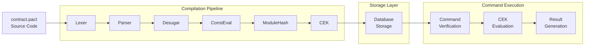

# Pact 5 Architecture Documentation

## Table of Contents

1. [Executive Summary](#executive-summary)
2. [System Architecture Overview](#system-architecture-overview)
3. [Lexical Analysis and Parsing](#lexical-analysis-and-parsing)
4. [Compilation Pipeline](#compilation-pipeline)
5. [CEK Evaluator Architecture](#cek-evaluator-architecture)
6. [Capability-Based Security System](#capability-based-security-system)
7. [Module System and Dependency Management](#module-system-and-dependency-management)
8. [Database and Persistence Layer](#database-and-persistence-layer)
9. [Hashing and Integrity System](#hashing-and-integrity-system)
10. [Command Execution Flow](#command-execution-flow)
11. [Gas Model and Performance](#gas-model-and-performance)
12. [Security Analysis](#security-analysis)
13. [Rust Migration Status](#rust-migration-status)

## Executive Summary

Pact 5 implements a sophisticated smart contract platform designed specifically for blockchain deployment. The architecture prioritizes security, determinism, and gas-bounded execution through:

- **Turing-incomplete language design** for safety guarantees
- **Capability-based authorization** for fine-grained security
- **Gas-metered execution** for DoS protection  
- **Formal module system** with cryptographic versioning
- **CEK abstract machine** for efficient evaluation
- **ACID database layer** for reliable state management

## System Architecture Overview

### Complete Execution Flow: "pact contract.pact" → Contract Execution



### Core Components

1. **Frontend**: Lexer/Parser pipeline (`pact/Pact/Core/Syntax/`)
2. **Compiler**: Desugar/ConstEval/ModuleHash (`pact/Pact/Core/IR/`)
3. **Evaluator**: CEK machine (`pact/Pact/Core/IR/Eval/CEK/`)
4. **Security**: Capabilities/Guards (`pact/Pact/Core/Capabilities.hs`)
5. **Modules**: Import/Dependency system (`pact/Pact/Core/`)
6. **Database**: Persistence layer (`pact/Pact/Core/Persistence/`)
7. **Runtime**: Command execution (`pact-request-api/`)

## Lexical Analysis and Parsing

### Lexer Implementation (`Pact/Core/Syntax/Lexer.x`)

**Technology**: Alex lexer generator with comprehensive token support

**Key Token Categories**:
- **Keywords**: `defun`, `defcap`, `defpact`, `module`, `interface`, `with-capability`
- **Operators**: Arithmetic (`+`, `-`, `*`, `/`), comparison (`>`, `<`, `>=`, `<=`, `=`, `!=`)
- **Special forms**: `step`, `step-with-rollback`, `bless`, `implements`
- **Literals**: Numbers, strings, booleans, with escape sequence support
- **Delimiters**: Parentheses, braces, brackets for s-expression structure

**Location Tracking**: Precise source location tracking via `SpanInfo`:
```haskell
data SpanInfo = SpanInfo
  { _liStartLine   :: !Int, _liStartColumn :: !Int  
  , _liEndLine     :: !Int, _liEndColumn   :: !Int }
```

### Parser Implementation (`Pact/Core/Syntax/Parser.y`)

**Technology**: Happy parser generator with LR parsing

**Grammar Structure**:
- **Modules**: `(module name governance [imports] [defs])`
- **Functions**: `(defun name [args] [body])`
- **Capabilities**: `(defcap name [args] [@managed/@event] [body])`
- **Schemas**: `(defschema name [fields])`
- **Tables**: `(deftable name:{schema})`

**AST Structure** (`Pact/Core/Syntax/ParseTree.hs`):
```haskell
data Expr i
  = Var ParsedName i
  | Lam [MArg i] (NonEmpty (Expr i)) i
  | App (Expr i) [Expr i] i
  | Let LetForm (NonEmpty (Binder i)) (NonEmpty (Expr i)) i
  | List [Expr i] i | Object [(Field, Expr i)] i
  | Constant Literal i
```

## Compilation Pipeline

### Compilation Phases

```
ParseTree → Desugar → Rename → ConstEval → ModuleHash → IR
```

**1. Desugaring Phase** (`Pact/Core/IR/Desugar.hs`):
- **Syntactic sugar elimination**: `and`, `or`, `if`, `cond` → core forms
- **Object binding desugaring**: `{:field var}` → let bindings
- **Special form handling**: `with-capability`, `enforce` → `BuiltinForm`
- **Name resolution**: Local variables, qualified names, imports

**2. Constant Evaluation** (`Pact/Core/IR/ConstEval.hs`):
- **Compile-time evaluation** of `defconst` definitions
- **Type checking** of evaluated constants
- **Gas-metered evaluation** to prevent DoS during compilation

**3. Module Hashing** (`Pact/Core/IR/ModuleHashing.hs`):
- **Cryptographic integrity**: Blake2b-256 hash computation
- **Reference updates**: Update all FQNs with computed hash
- **Gas charging**: Size-based gas costs for hashing operations

### Intermediate Representation (IR)

**IR Term Structure** (`Pact/Core/IR/Term.hs`):
```haskell
data Term name ty builtin info
  = Var name info
  | Lam (NonEmpty (Arg ty info)) (Term name ty builtin info) info
  | Let (Arg ty info) (Term name ty builtin info) (Term name ty builtin info) info
  | App (Term name ty builtin info) [Term name ty builtin info] info
  | BuiltinForm (BuiltinForm (Term name ty builtin info)) info
  | Builtin builtin info | Constant Literal info
  | Sequence (Term name ty builtin info) (Term name ty builtin info) info
  | Nullary (Term name ty builtin info) info
```

## CEK Evaluator Architecture

### Machine State Components

**Control-Environment-Kontinuation-Handler (CEKH) Machine**:

```haskell
-- Control: What's being evaluated
data EvalTerm b i = Term (Term Name Type b i) | Value (CEKValue e b i)

-- Environment: Runtime context  
data CEKEnv e b i = CEKEnv
  { _ceLocal :: RAList (CEKValue e b i)     -- Variable bindings
  , _cePactDb :: PactDb b i                 -- Database access
  , _ceBuiltins :: BuiltinEnv e b i         -- Native functions
  , _ceDefPactStep :: Maybe DefPactStep     -- DefPact state
  , _ceInCap :: Bool }                      -- Capability scope

-- Kontinuation: Evaluation context
data Cont e b i
  = Mt | Fn !(CanApply e b i) !(CEKEnv e b i) ![EvalTerm b i] ![CEKValue e b i] !(Cont e b i)
  | Args !(CEKEnv e b i) i ![EvalTerm b i] !(Cont e b i)
  | LetC !(CEKEnv e b i) i (Arg Type i) !(EvalTerm b i) !(Cont e b i)
  | CapInvokeC !(CEKEnv e b i) i (CapCont e b i) !(Cont e b i)
```

### Evaluation Rules

**Key Transition Rules**:
- **Variable**: `<Var n, E, K, H> → <E(n), E, K, H>`
- **Application**: `<App fn args, E, K, H> → <fn, E, Args(E,args,K), H>`
- **Lambda**: `<Lam args body, E, K, H> → <VLamClo(args,body,E), E, K, H>`
- **Let**: `<Let e1 e2, E, K, H> → <e1, E, LetC(E,e2,K), H>`

### Builtin Function Integration

**Native Function Interface**:
```haskell
type NativeFunction e b i
  = i -> b -> Cont e b i -> CEKErrorHandler e b i -> CEKEnv e b i 
  -> [CEKValue e b i] -> EvalM e b i (EvalResult e b i)
```

## Capability-Based Security System

### Capability Architecture

**Capability Types**:
- **Unmanaged**: Simple boolean authorization capabilities
- **Managed**: Linear resource tracking with manager functions (`@managed`)
- **Event**: Event emission capabilities (`@event`)

**Runtime State**:
```haskell
data CapState name v = CapState
  { _csSlots :: [CapSlot name v]           -- Active capability stack
  , _csManaged :: Set (ManagedCap name v)  -- Installed managed caps
  , _csAutonomous :: Set (CapToken name v) -- Autonomously granted caps
  , _csCapsBeingEvaluated :: Set (CapToken name v) }
```

### Security Properties

**Access Control**:
- **Principle of least privilege**: Explicit capability grants required
- **Automatic cleanup**: Capabilities revoked when scope ends
- **Composition safety**: `compose-capability` for hierarchical authorization
- **Linear resource tracking**: Manager functions prevent double-spending

## Module System and Dependency Management

### Module Organization

**Module Structure**:
- **Namespace isolation**: Modules grouped by namespaces
- **Versioning**: Cryptographic hash-based versioning
- **Governance**: Per-module access control via keysets/capabilities
- **Interfaces**: Abstract contracts for module implementations

**Import Resolution**:
```haskell
data Import = Import
  { _impModuleName :: ModuleName
  , _impModuleHash :: Maybe ModuleHash    -- Version pinning
  , _impImported :: Maybe [Text] }        -- Selective imports
```

### Transitive Dependency Algorithm

**Gas-Metered BFS Algorithm**:
1. **Initialize**: Start with module's direct definitions
2. **Analyze**: Extract FQN dependencies from term structures  
3. **Expand**: Breadth-first expansion of dependency closure
4. **Gas accounting**: Logarithmic costs for set operations
5. **Termination**: Fixed-point or gas exhaustion

## Database and Persistence Layer

### Database Abstraction

**PactDb Interface**:
```haskell
data PactDb b i = PactDb
  { _pdbPurity :: !Purity                 -- Read-only/write modes
  , _pdbRead :: forall k v. Domain k v b i -> k -> GasM b i (Maybe v)
  , _pdbWrite :: forall k v. WriteType -> Domain k v b i -> k -> v -> GasM b i ()
  , _pdbKeys :: forall k v. Domain k v b i -> GasM b i [k]
  , _pdbBeginTx :: ExecutionMode -> GasM b i (Maybe TxId)
  , _pdbCommitTx :: GasM b i [TxLog ByteString]
  , _pdbRollbackTx :: GasM b i () }
```

### Storage Domains

**Type-Safe Domain Separation**:
```haskell
data Domain k v b i where
  DUserTables :: !TableName -> Domain RowKey RowData b i
  DKeySets :: Domain KeySetName KeySet b i
  DModules :: Domain ModuleName (ModuleData b i) b i
  DNamespaces :: Domain NamespaceName Namespace b i
  DDefPacts :: Domain DefPactId (Maybe DefPactExec) b i
```

## Hashing and Integrity System

### Hash Implementation

**Primary Algorithm**: Blake2b-256 for all cryptographic hashing

**Hash Applications**:
- **Module versioning**: Deterministic module hash computation
- **Transaction integrity**: Command payload verification  
- **Database integrity**: Transaction log hashing
- **Dependency verification**: Transitive dependency validation

### Stable Encoding

**Deterministic Serialization**:
- **JSON canonicalization**: Consistent field ordering
- **CBOR encoding**: Binary serialization for efficiency
- **Cross-platform consistency**: Deterministic across environments

## Command Execution Flow

### Command Structure

**Command Anatomy**:
```haskell
data Command a = Command
  { _cmdPayload :: !a              -- RPC payload
  , _cmdSigs :: ![UserSig]         -- Cryptographic signatures  
  , _cmdHash :: !PactHash.Hash }   -- Payload hash

data Payload m c = Payload
  { _pPayload :: !(PactRPC c)      -- Exec or Continuation
  , _pNonce :: !Text               -- Replay protection
  , _pMeta :: !m                   -- Gas limits, chain data
  , _pSigners :: ![Signer]         -- Multi-sig support
  , _pVerifiers :: !(Maybe [Verifier ParsedVerifierProof]) }
```

### Execution Pipeline

**Complete Flow**:
1. **Command Reception**: HTTP API endpoints (`/send`, `/local`, `/poll`)
2. **Verification**: Signature verification, hash validation, payload parsing
3. **Environment Setup**: Database access, gas limits, capability grants
4. **Evaluation**: CEK machine execution with gas metering
5. **Result Generation**: Transaction logs, gas consumption, events
6. **Storage**: Command results stored for polling/listening

## Gas Model and Performance

### Gas Metering System

**Gas Categories**:
- **Arithmetic operations**: Size-based costs (e.g., large integer arithmetic)
- **Memory operations**: List/object concatenation costs
- **Database operations**: Read (2,500 mgas), Write (25,000 mgas), per-byte costs
- **Cryptographic operations**: Hash computation, signature verification
- **Module operations**: Dependency resolution, compilation

### Performance Characteristics

**Optimizations**:
- **Strict evaluation**: Bang patterns on critical paths
- **Inline functions**: Strategic inlining for hot code paths
- **Memory management**: RAList for efficient local environments
- **Gas-aware algorithms**: Logarithmic complexity bounds with gas charging

## Security Analysis

### Attack Surface Analysis

**Potential Vulnerabilities**:
1. **Manager function bugs**: Incorrect linear resource logic
2. **Capability composition confusion**: Complex authorization hierarchies
3. **Gas exhaustion**: DoS via expensive operations
4. **Reentrancy**: Cross-module reentrancy attacks

**Mitigations**:
1. **Formal verification**: Mathematical proofs for critical components
2. **Gas metering**: Comprehensive cost model prevents DoS
3. **Capability isolation**: Fine-grained access control
4. **Reentrancy guards**: Built-in reentrancy protection

### Security Properties

**Guarantees**:
- **Deterministic execution**: Same inputs always produce same outputs
- **Gas-bounded computation**: All operations have predictable costs
- **Capability containment**: No ambient authority, explicit grants required
- **Transaction atomicity**: All-or-nothing execution with rollback
- **Module immutability**: Deployed modules cannot be modified without governance

## Rust Migration Status

The Pact team is actively migrating performance-critical components to Rust. Current status:

### Overall Progress
- **Foundation Layer**: 95% complete (28 Rust crates)
- **Lexer/Parser**: 95% complete 
- **Compilation Pipeline**: 80% complete
- **CEK Evaluator**: 60% complete
- **Module System**: 85% complete
- **Database Layer**: 75% complete
- **CLI/REPL**: 70% complete

### Critical Implementation Notes

1. **Transitive Dependencies**: Must implement exact BFS algorithm matching Haskell
2. **Builtin Registration**: Follow Haskell patterns exactly
3. **Module Storage**: Complete integration with dependency closure
4. **No Workarounds**: Maintain exact semantic compatibility

## Key Architectural Insights

### Design Philosophy

1. **Safety First**: Turing-incomplete language prevents infinite loops
2. **Security by Design**: Capability-based authorization throughout
3. **Determinism**: Predictable execution for consensus systems  
4. **Gas Awareness**: Every operation has bounded computational cost
5. **Formal Methods**: Mathematical foundations for security properties

### Blockchain-Specific Optimizations

1. **Module versioning**: Cryptographic integrity with controlled upgrades
2. **Transitive dependencies**: Formal dependency analysis prevents runtime failures
3. **Gas model**: Asymptotic complexity bounds for all operations
4. **Multi-signature**: Native support for multi-party authorization
5. **DefPact continuations**: Built-in support for multi-step transactions

## Conclusion

Pact 5 represents a sophisticated smart contract platform specifically designed for blockchain deployment. The architecture successfully balances the competing demands of safety, security, performance, and developer experience through comprehensive type safety, formal security models, predictable performance, reliable persistence, and developer-friendly tooling.

The combination of Turing-incomplete evaluation, capability-based security, formal module system, and gas-bounded execution creates a robust foundation for mission-critical smart contract applications where safety and security are paramount.
